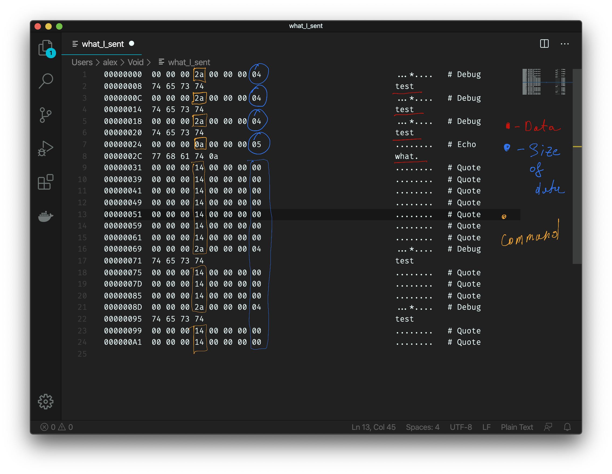

# Quote of the Day

## Introduction

QotD ended up being worth 490 points in the Reverse Engineering category. 


From here, you get a binary to investigate as the client. When you run it, you get 2 options to play around with: e (to echo something back) and q (to get a quote).


## Reverse Engineering 

The challenge hints about a backdoor in the client, let's throw the client binary into a disassembler of our choice and take a look!


Immediately, you can see a few compare statements. Most of them check if the character is outside of the range of allowed characters. For example, the 3rd compare checks if the character entered is a 'q.' If it's not, anything above a 'q' in the ASCII table is invalid input, and thus if it is greater than a q, the client prints out an error message.

The very first branch is what we are interested in, the input character is compared to a '~' and if that is the case, it calls do_debug_test. 

Let's see what happens when we use the client binary and give it a '~'. 


```
result(99): badload
try:old.qotd,default.qotd
```
At this point, I was too lazy to RE the rest of the client, I just finished RustyVault, Time Window, and Pirate flag, and wanted an easy way out. So I threw the binary into an Ubuntu VM and captured the packets sent using Wireshark, hoping it would shed some light on how the client works.

Here is the capture that I got!


Bingo! If you look at just the client->server conversation, it is clear how the protocol works. 

Here is my annotated version of the screenshot. 


There are 8-byte commands, followed by any data that is necessary by that command. The last 4 bytes of the command seems to be the length of data you're going to provide, and since I ran `echo`, `debug`, and `quote`, we can see what the first 4 bytes of each command are going to be!

So, let's get coding! Maybe you need to send `old` or `old.qotd` as the data for DEBUG, and we get the flag! 

First, let's hard code those constants we got from the packet capture!

```python
DEBUG   = b'\x00\x00\x00\x2a\x00\x00'
QUOTE   = b'\x00\x00\x00\x14\x00\x00\x00\x00'
ECHO    = b'\x00\x00\x00\x0a\x00\x00'
```

Now let's write functions to send an `echo`, `debug`, and `quote` commands! We need to append the length to `echo` and `debug`, here I left 2 bytes off for those. 

```python
def get_echo(soc, bytes):
  txt = get_echo_command(bytes)
  de(txt)
  soc.send(txt)
  return soc.recv(1024)

def get_quote(soc):
  de(QUOTE)
  soc.send(QUOTE)
  return soc.recv(1024)


def get_debug(soc, text=b'test'):
  txt = DEBUG + len(text).to_bytes(2, 'big') + text
  de(txt)
  soc.send(txt)
  return soc.recv(1024)
```

Note the function `de`. This is just a helper function that prints out the bytes with a prefix (You can see the full code in the code directory or at the end of this markdown).

Now let's test this! Let's send a debug command with `old` in the data portion.

```python
print(get_debug(s, b'old'))
```


Ignoring the bytes at the beginning, all we get is cha-ching. Now during the competition, I felt like I hit another dead end. However, the challenge did mention something about the software being *new*, so I decided to spam out some quotes to see if I get lucky.

The whole code looked something like this. 

```python
#!/usr/bin/env python3
import socket

target = ("cha.hackpack.club", 41709)
s = socket.socket(socket.AF_INET, socket.SOCK_STREAM)
s.connect(target)

DEBUG   = b'\x00\x00\x00\x2a\x00\x00'
QUOTE   = b'\x00\x00\x00\x14\x00\x00\x00\x00'
ECHO    = b'\x00\x00\x00\x0a\x00\x00'


def display(s):
  print(b"[+] Got back: " + s)
def de(s):
  print(b"[-] Sending: " + s)
def get_echo_command(s):
  return ECHO + len(s).to_bytes(2, 'big') + s

def get_echo(soc, bytes):
  txt = get_echo_command(bytes)
  de(txt)
  soc.send(txt)
  return soc.recv(1024)

def get_quote(soc):
  de(QUOTE)
  soc.send(QUOTE)
  return soc.recv(1024)


def get_debug(soc, text=b'test'):
  txt = DEBUG + len(text).to_bytes(2, 'big') + text
  de(txt)
  soc.send(txt)
  return soc.recv(1024)

print(s.recv(1024).decode('utf-8'))

display(get_debug(s, b'old'))
display(get_quote(s))
display(get_quote(s))
display(get_quote(s))
display(get_quote(s))
display(get_quote(s))
display(get_quote(s))
display(get_quote(s))
display(get_quote(s))
display(get_quote(s))
display(get_quote(s))
display(get_quote(s))
display(get_quote(s))
display(get_quote(s))
display(get_quote(s))
display(get_quote(s))
display(get_quote(s))
display(get_quote(s))
display(get_quote(s))
display(get_quote(s))
display(get_quote(s))
```


Yes! We got the flag!

## Conclusion

Overall, I feel like looking at the disassembly of just patching the binary would have been a faster way to solve this. But I went down a few dead ends when solving this challenge and having a python script that mimicked the client made sure that I had something I could re-purpose at the end of each attempt. 